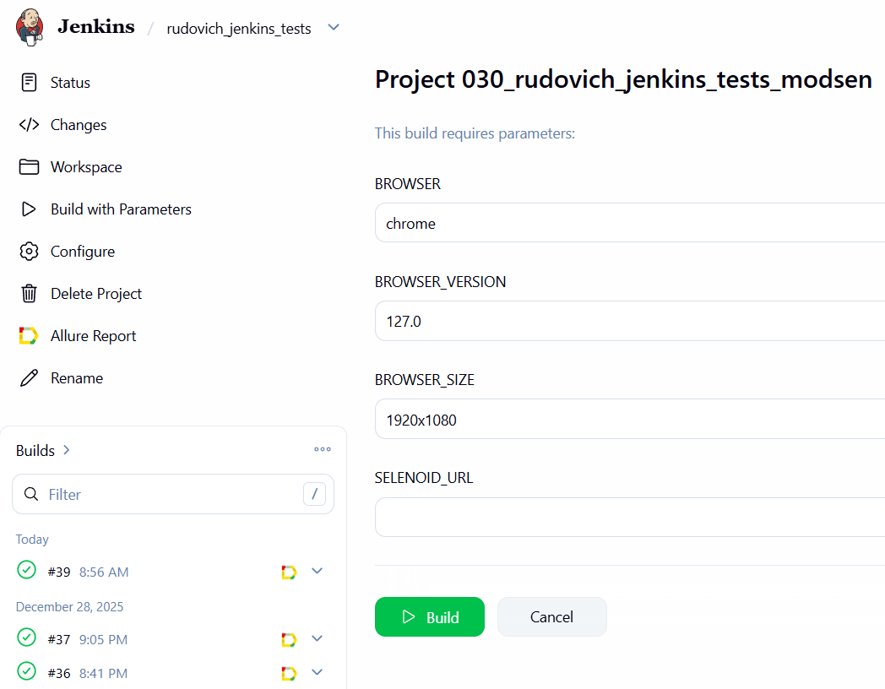
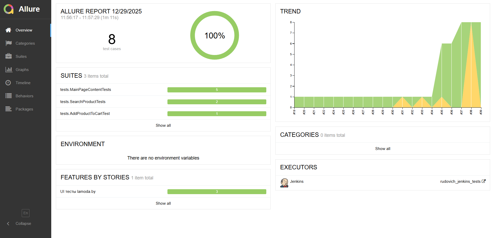
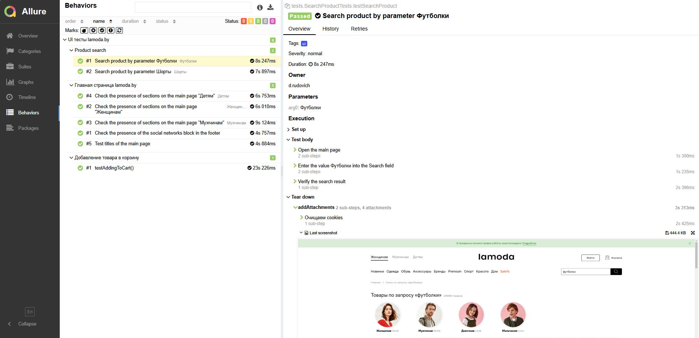
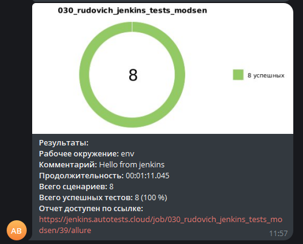

# Project: Automated Testing of Online Store [Lamoda](https://www.lamoda.by/)

## :open_book: Table of Contents:

- [Technologies and Tools](#gear-technologies-and-tools)
- [Test Cases](#heavy_check_mark-test-cases)
- [Running Tests](#computer-running-tests-from-terminal)
- [Running Tests in Jenkins](#running-tests-in-jenkins)
- [Allure Report](#allure-report)
- [Telegram Notifications](#telegram-notifications)
- [Test Execution Video](#movie_camera-test-execution-video)

## :gear: Technologies and Tools

<p align="left">
<a href="https://www.jetbrains.com/idea/"></a>
<a href="https://www.java.com/"></a>
<a href="https://github.com/"></a>
<a href="https://junit.org/junit5/"></a>
<a href="https://gradle.org/"></a>
<a href="https://selenide.org/"></a>
<a href="https://aerokube.com/selenoid/"></a>
<a href="https://github.com/allure-framework/allure2"></a>
<a href="https://www.jenkins.io/"></a>
<a href="https://web.telegram.org/"></a>
</p>

This project contains automated tests written in **Java** using the **Selenide** testing framework.  
**Gradle** is used for project build management in **IntelliJ IDEA**.  
**JUnit5** is used as the unit testing framework.  
Tests are executed via **Jenkins**.  
**Selenoid** is used to run browsers inside **Docker** containers.

**Allure Report** and **Telegram Bot** are used for visualization and reporting of test results.

## :heavy_check_mark: Test Cases

- Verify adding a product to the cart
- Verify presence of main page headers
- Verify presence of sections on the main page
- Verify presence of the social networks block in the footer
- Verify product search functionality

## :computer: Running Tests from Terminal

### :house_with_garden: Local Test Execution

```bash
gradle clean test
```

### :earth_asia: Remote Test Execution

```bash
gradle clean test
-Dbrowser=${browser}
-DbrowserVersion=${browserVersion}
-DbrowserSize=${browserSize}
-DremoteDriverUrl={REMOTE_DRIVER_URL}
```

## Running Tests in Jenkins

* browser (default: chrome)
* browserVersion (default: 100.0)
* browserSize (default: 1920x1080)
* remoteDriverUrl (Selenoid URL)
* videoStorage (URL for test execution videos)

##  Running Tests in [Jenkins](https://jenkins.autotests.cloud/job/030_rudovich_jenkins_tests_modsen/)

To start a build, go to <code><strong>Build with Parameters</strong></code> and click <code><strong>Build</strong></code>.

<p align="center">
  
</p>

## :allure: Report
##  Result of Testing in   [Allure Report](https://jenkins.autotests.cloud/job/015_aziyatdinov_final_ui/1/allure/)

<p align="center">
  
</p>

<p align="center">
  
</p>

## :telegram: Notifications
##  Telegram Notifications

After the build is complete, a dedicated bot in <code>Telegram</code> automatically processes and sends a message with
the test run report.

<p align="center">


## :movie_camera: Test Execution Video

In Allure reports, each test includes not only screenshots but also a video recording of the test execution.

<p align="center">
  
</p>